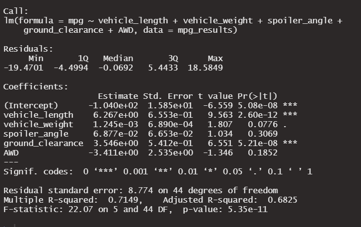
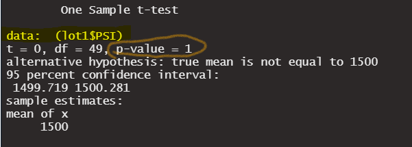
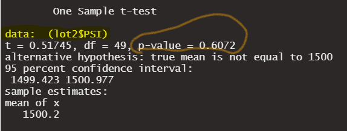
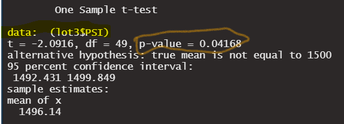

# MechaCar_Statistical_Analysis

## Linear Regression to Predict MPG

Questions to answer:
1. **Which variables/coefficients provided a non-random amount of variance to the mpg values in the dataset?** Based on the results of the linear regression analysis, we can see from the above screen shot that vehicle length and ground clearance seem to produce the least non-random variance due to significance at the <0.001 level. All other variables tested seem to produce more random results and are not well correleated to MPG. The other interesting result is that the intercept also was statistically significant at the <0.001 level, indicating that there are other variables and factors that contribute to the variation in MPG that were not included in the model. 
2. **Is the slope of the linear model considered to be zero? Why or why not?** No, the slope of the model is not 0. Our null hypothesis that we were testing is that the slope is 0. However, based on the overall p-value from the above screen shot of our linear regression analysis, p = 5.35e-11, which is much smaller than the typical significance lever of 0.05%, we have sufficient evidence to reject our null hypothesis of a 0 slope. 
3. **Does this linear model predict mpg of MechaCar prototypes effectively? Why or why not?** Yes, upon analysis, this model seems to predict MPG of the prototypes fairly well. When we look at the R-squared value, 0.7149, that would seem to suggest a fairly strong degree of correlation and prediction between some of the independent variables and the MPG. 

## Summary Statistics on Suspension Coils

Questions to answer:
1. **The design specifications for the MechaCar suspension coils dictate that the variance of the suspension coils must not exceed 100 pounds per square inch. Does the current manufacturing data meet this design specification for all manufacturing lots in total and each lot individually? Why or why not?** Yes, when we look at the Total Summary analysis, we see that the variance and the SD for the entire sample population have a fairly tight distribution and do not vary too far from the the mean of the Population of 1500 lbs/sqin. With a sample mean of 1498.78 and a SD or about 8, we know that the look at the sample collectively almost 100% of the values lie within 1498.78 +/- 24 (3 SD from the mean). Although we do see a diffence when we look at the Lot subsets, they also indicate that the variance of the data meets the predetermined tolerance level of 100 lbs/sqin. Lot1 has a very small SD and Variance, so this lot seems to perform the best statistically. Lot 2 has a slightly larger Var and SD, but still all values seem to be very close to the mean of that subset. Lot 3 does stand out as a potential issue as the Var and SD are much larger than the other two lots. However, when we use the analysis to determeine whether or not Lot 3 still meets tolerance levels, we are fairly certain that almost 100% of the values lie within the value of 1496.14 +/- 39 lbs/sqin, which meets the tolerance limits. Although on first glance it would seem that this would not be the case as the variance for Lot3 measures at 170, but this number does not have the units of lbs/sqin as it is the square of the SD. So we need to use the SD number when looking at the spread of the values from the mean to determine whether the Lot meets the tolerance limits. 

## T-Tests on Suspension Coils

When running a T-test analysis on the entire sample data, which compares the mean of the sample to the mean of the population with a null hypotheis of no difference in the means, we see that the means do not vary significantly as the p-value = 0.06028, above our significance value of 0.05.

Things do change a bit when we run the T-tests on each Lot subset. Lot one has a very strong p-value = 1.0, which would tell us the Lot1 mean is essentially the same as the population mean. Lot 2 has a p-value = 0.6072, not quite as strong at Lot 1, but still above our significance level and we would therefore not reject the null hypothesis. Meaning that the means between lot 2 and the population mean are statistically similar. When we look at the Lot 3 statisitcs, we see that the p-value of the t-test comparison is 0.04168, less than our significance value and thus we would be able to say that sufficient evidence exists to reject the null hypothesis and say that the means of Lot3 and the population vary at the statistical significance value.

This might make MechaCar re-evaluate their lot 3 sustpension coils as the means vary and this lot seemed to have a large variance and SD compared to the other two lots. 

## Study Design: MechaCar vs Competition

Questions to answer:

Now that MechaCar has some sample data on its prototype vehicle, they may want to compare their data to their existing competitors on the market. I would recommend using MPG, as many consumers are looking for value in their vehicle and would like to see a high MPG, both city and highway. The other value I would use an overall comfort rating. This data already exists for vehicles that are on the market. If MechaCar doesn't have this data, they could collect this data based on similar questions and ratings that their competitors use.

1. **What metric or metrics are you going to test?** As stated above, I would use MPG and Comfort. 

2. **What is the null hypothesis or alternative hypothesis?** The null hypothesis would be that the mean values for all vehicles is the same. The alternative hypothesis would be that at least on mean do varies by a level of statistical significance.

3. **What statistical test would you use to test the hypothesis? And why?** I would use the ANOVA test as we would be looking at data from essentially multiple samples as we may be including multiple manufactures to see how MechaCar would stand up to each manufacturer.

4. **What data is needed to run the statistical test?** We would need fairly large sample sizes to increase the power of our analysis for both the MPG and Comfort ratings for the various manufacturers. We would need to ensure that the dependent variable (MPG and comfort) are numerial and continuous for the categorical independent variable (manufacturer). We would also rund some preliminary analysis on the datasets to ensure that the the MPG and comfort values are normally distributed and show similar variance between manufacturers.
