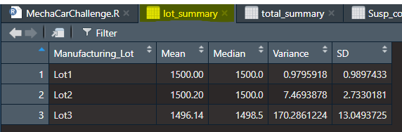

# MechaCar_Statistical_Analysis

## Linear Regression to Predict MPG

Questions to answer:
1. **Which variables/coefficients provided a non-random amount of variance to the mpg values in the dataset?** Based on the results of the linear regression analysis, we can see from the above screen shot that vehicle length and ground clearance seem to produce the least non-random variance due to significance at the <0.001 level. All other variables tested seem to produce more random results and are not well correleated to MPG. The other interesting result is that the intercept also was statistically significant at the <0.001 level, indicating that there are other variables and factors that contribute to the variation in MPG that were not included in the model. 
2. **Is the slope of the linear model considered to be zero? Why or why not?** No, the slope of the model is not 0. Our null hypothesis that we were testing is that the slope is 0. However, based on the overall p-value from the above screen shot of our linear regression analysis, p = 5.35e-11, which is much smaller than the typical significance lever of 0.05%, we have sufficient evidence to reject our null hypothesis of a 0 slope. 
3. **Does this linear model predict mpg of MechaCar prototypes effectively? Why or why not?** Yes, upon analysis, this model seems to predict MPG of the prototypes fairly well. When we look at the R-squared value, 0.7149, that would seem to suggest a fairly strong degree of correlation and prediction between some of the independent variables and the MPG. 

## Summary Statistics on Suspension Coils

## T-Tests on Suspension Coils

## Study Design: MechaCar vs Competition
